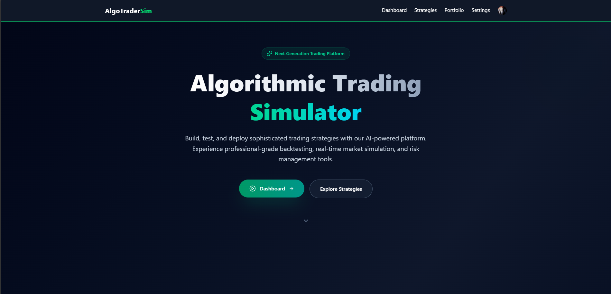
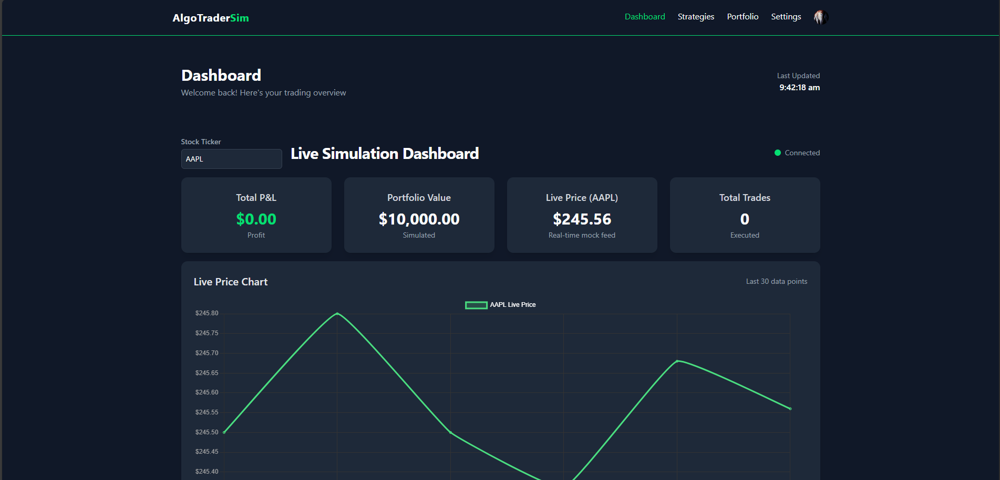
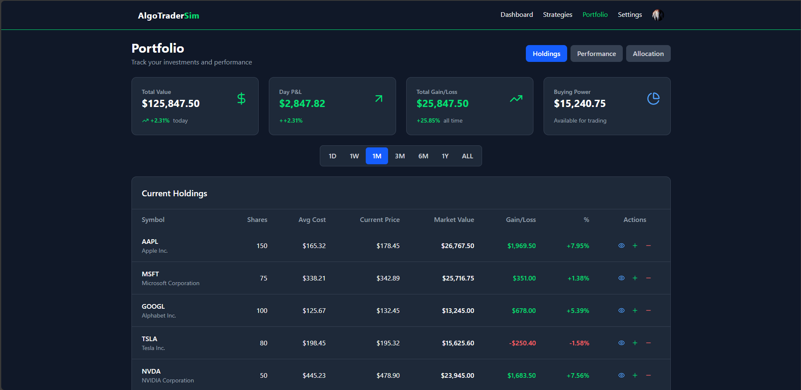
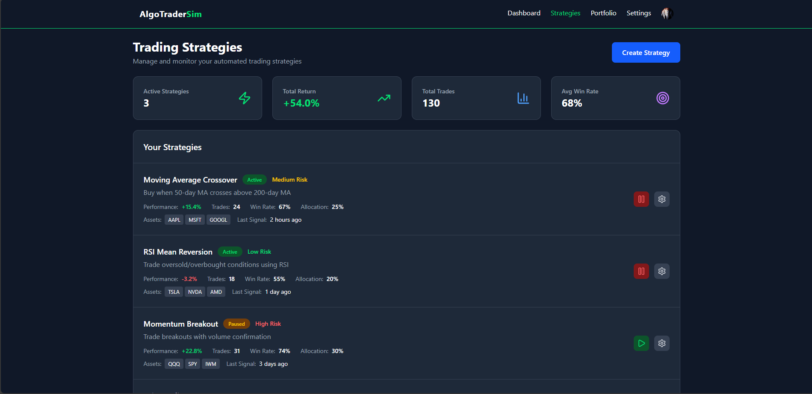
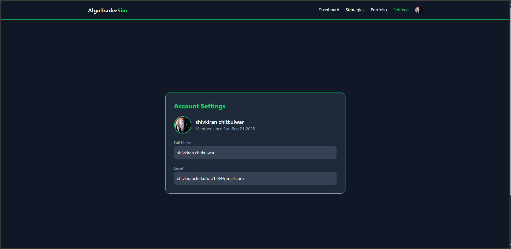

# JarNox-TradeApp

Welcome to  **JarNox-TradeApp** , a web application built with React and Vite. This document will guide you through the setup and running of the project on your local machine.

### Getting Started

To get a copy of the project up and running, follow these simple steps.

1. **Clone the repository:**

   ```
   git clone [https://github.com/SSCoderin/JarNox-TradeApp.git](https://github.com/SSCoderin/JarNox-TradeApp.git)


   ```
2. **Navigate to the project directory:**

   ```
   cd JarNox-TradeApp


   ```
3. **Install the dependencies:**

   ```
   npm i


   ```
4. **Start the development server:**

   ```
   npm run dev


   ```

   The application will now be running on `http://localhost:5173` (or another port if 5173 is in use).

### Environment Variables

Before running the application, you need to create a `.env` file in the root directory. This file will contain your environment-specific configuration.

**Required variables:**

* `VITE_CLERK_PUBLISHABLE_KEY`: This is your public key for the Clerk authentication service. To get this key, you'll need to first log in to your Clerk account and create a new project. You can find the key in your project's dashboard.
* `VITE_BASE_URL`: This is the base URL for your API. A common value for local development is `.`, which signifies the root of your application.

**Example `.env` file:**

```
VITE_CLERK_PUBLISHABLE_KEY=pk_your_clerk_publishable_key
VITE_BASE_URL = .


```

### Project Screenshots

**Here are some screenshots showcasing the application's key features.**

1. **Login Page**  
   

2. **Dashboard**  
   

3. **Portfolio View**  
   

4. **Trading Strategies**  
   

5. **Settings Page**  
   

